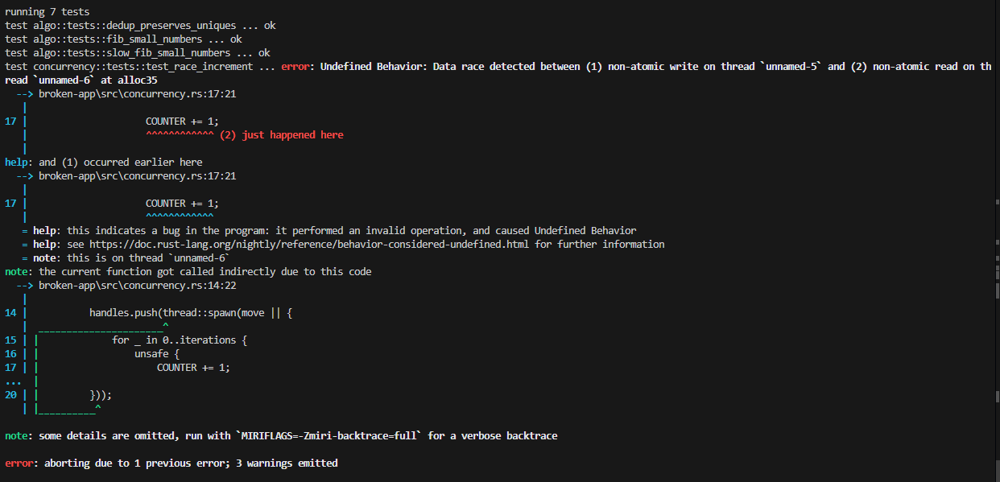

# Артефакт: гонка данных в [race_increment](../src/concurrency.rs)

### Проблема

Изменение счетчика из разных потоков без методов синхронизации

### Код

```rust
static mut COUNTER: u64 = 0;

/// Небезопасный инкремент через несколько потоков.
/// Использует global static mut без синхронизации — data race.
pub fn race_increment(iterations: usize, threads: usize) -> u64 {
    unsafe {
        COUNTER = 0;
    }
    let mut handles = Vec::new();
    for _ in 0..threads {
        handles.push(thread::spawn(move || {
            for _ in 0..iterations {
                unsafe {
                    COUNTER += 1;
                }
            }
        }));
    }
    for h in handles {
        let _ = h.join();
    }
    unsafe { COUNTER }
}
```

### Фикс

Заменяем на AtomicU64

### Логи (miri)



### Логи (sanitizer)

```bash
RUSTFLAGS=-Zsanitizer=thread cargo run -p broken-app -Zbuild-std --target x86_64-unknown-linux-gnu
```

```bash
warning: `broken-app` (lib) generated 3 warnings (run `cargo fix --lib -p broken-app` to apply 1 suggestion)
    Finished `dev` profile [unoptimized + debuginfo] target(s) in 21.05s
     Running `target/x86_64-unknown-linux-gnu/debug/demo`
sum_even: 6
non-zero bytes: 3
normalize: helloworld
fib(20): 6765
dedup: [1, 2, 3, 4]
/usr/bin/addr2line: DWARF error: mangled line number section (bad file number)
==================
WARNING: ThreadSanitizer: data race (pid=8923)
  Read of size 8 at 0x5583ba094590 by thread T2:
    #0 broken_app::concurrency::race_increment::{closure#0} /app/broken-app/src/concurrency.rs:17 (demo+0x1cce71) (BuildId: 33e5dccaf00b0081338ac32ef01b7df727a3f4f6)
    #1 std::sys::backtrace::__rust_begin_short_backtrace::<broken_app::concurrency::race_increment::{closure#0}, ()> /usr/local/rustup/toolchains/nightly-x86_64-unknown-linux-gnu/lib/rustlib/src/rust/library/std/src/sys/backtrace.rs:166 (demo+0x1ccd41) (BuildId: 33e5dccaf00b0081338ac32ef01b7df727a3f4f6)
    #2 std::thread::lifecycle::spawn_unchecked::<broken_app::concurrency::race_increment::{closure#0}, ()>::{closure#1}::{closure#0} /usr/local/rustup/toolchains/nightly-x86_64-unknown-linux-gnu/lib/rustlib/src/rust/library/std/src/thread/lifecycle.rs:91 (demo+0x1cc593) (BuildId: 33e5dccaf00b0081338ac32ef01b7df727a3f4f6)
    #3 <core::panic::unwind_safe::AssertUnwindSafe<std::thread::lifecycle::spawn_unchecked<broken_app::concurrency::race_increment::{closure#0}, ()>::{closure#1}::{closure#0}> as core::ops::function::FnOnce<()>>::call_once /usr/local/rustup/toolchains/nightly-x86_64-unknown-linux-gnu/lib/rustlib/src/rust/library/core/src/panic/unwind_safe.rs:274 (demo+0x1b7299) (BuildId: 33e5dccaf00b0081338ac32ef01b7df727a3f4f6)
    #4 std::panicking::catch_unwind::do_call::<core::panic::unwind_safe::AssertUnwindSafe<std::thread::lifecycle::spawn_unchecked<broken_app::concurrency::race_increment::{closure#0}, ()>::{closure#1}::{closure#0}>, ()> /usr/local/rustup/toolchains/nightly-x86_64-unknown-linux-gnu/lib/rustlib/src/rust/library/std/src/panicking.rs:581 (demo+0x1b6e7f) (BuildId: 33e5dccaf00b0081338ac32ef01b7df727a3f4f6)
    #5 __rust_try 2ioylavd7zzu6fzwrmmg6hjuv:? (demo+0x1b7208) (BuildId: 33e5dccaf00b0081338ac32ef01b7df727a3f4f6)
    #6 std::panicking::catch_unwind::<(), core::panic::unwind_safe::AssertUnwindSafe<std::thread::lifecycle::spawn_unchecked<broken_app::concurrency::race_increment::{closure#0}, ()>::{closure#1}::{closure#0}>> /usr/local/rustup/toolchains/nightly-x86_64-unknown-linux-gnu/lib/rustlib/src/rust/library/std/src/panicking.rs:544 (demo+0x1b6af3) (BuildId: 33e5dccaf00b0081338ac32ef01b7df727a3f4f6)
    #7 std::panic::catch_unwind::<core::panic::unwind_safe::AssertUnwindSafe<std::thread::lifecycle::spawn_unchecked<broken_app::concurrency::race_increment::{closure#0}, ()>::{closure#1}::{closure#0}>, ()> /usr/local/rustup/toolchains/nightly-x86_64-unknown-linux-gnu/lib/rustlib/src/rust/library/std/src/panic.rs:359 (demo+0x1b6979) (BuildId: 33e5dccaf00b0081338ac32ef01b7df727a3f4f6)
    #8 std::thread::lifecycle::spawn_unchecked::<broken_app::concurrency::race_increment::{closure#0}, ()>::{closure#1} /usr/local/rustup/toolchains/nightly-x86_64-unknown-linux-gnu/lib/rustlib/src/rust/library/std/src/thread/lifecycle.rs:89 (demo+0x1cc192) (BuildId: 33e5dccaf00b0081338ac32ef01b7df727a3f4f6)
    #9 <std::thread::lifecycle::spawn_unchecked<broken_app::concurrency::race_increment::{closure#0}, ()>::{closure#1} as core::ops::function::FnOnce<()>>::call_once::{shim:vtable#0} /usr/local/rustup/toolchains/nightly-x86_64-unknown-linux-gnu/lib/rustlib/src/rust/library/core/src/ops/function.rs:250 (demo+0x1b5785) (BuildId: 33e5dccaf00b0081338ac32ef01b7df727a3f4f6)
    #10 <alloc::boxed::Box<dyn core::ops::function::FnOnce<(), Output = ()> + core::marker::Send> as core::ops::function::FnOnce<()>>::call_once /usr/local/rustup/toolchains/nightly-x86_64-unknown-linux-gnu/lib/rustlib/src/rust/library/alloc/src/boxed.rs:2240 (demo+0x2a15ee) (BuildId: 33e5dccaf00b0081338ac32ef01b7df727a3f4f6)
    #11 <std::sys::thread::unix::Thread>::new::thread_start /usr/local/rustup/toolchains/nightly-x86_64-unknown-linux-gnu/lib/rustlib/src/rust/library/std/src/sys/thread/unix.rs:118 (demo+0x348eee) (BuildId: 33e5dccaf00b0081338ac32ef01b7df727a3f4f6)

  Previous write of size 8 at 0x5583ba094590 by thread T1:
    #0 broken_app::concurrency::race_increment::{closure#0} /app/broken-app/src/concurrency.rs:17 (demo+0x1cced0) (BuildId: 33e5dccaf00b0081338ac32ef01b7df727a3f4f6)
    #1 std::sys::backtrace::__rust_begin_short_backtrace::<broken_app::concurrency::race_increment::{closure#0}, ()> /usr/local/rustup/toolchains/nightly-x86_64-unknown-linux-gnu/lib/rustlib/src/rust/library/std/src/sys/backtrace.rs:166 (demo+0x1ccd41) (BuildId: 33e5dccaf00b0081338ac32ef01b7df727a3f4f6)
    #2 std::thread::lifecycle::spawn_unchecked::<broken_app::concurrency::race_increment::{closure#0}, ()>::{closure#1}::{closure#0} /usr/local/rustup/toolchains/nightly-x86_64-unknown-linux-gnu/lib/rustlib/src/rust/library/std/src/thread/lifecycle.rs:91 (demo+0x1cc593) (BuildId: 33e5dccaf00b0081338ac32ef01b7df727a3f4f6)
    #3 <core::panic::unwind_safe::AssertUnwindSafe<std::thread::lifecycle::spawn_unchecked<broken_app::concurrency::race_increment::{closure#0}, ()>::{closure#1}::{closure#0}> as core::ops::function::FnOnce<()>>::call_once /usr/local/rustup/toolchains/nightly-x86_64-unknown-linux-gnu/lib/rustlib/src/rust/library/core/src/panic/unwind_safe.rs:274 (demo+0x1b7299) (BuildId: 33e5dccaf00b0081338ac32ef01b7df727a3f4f6)
    #4 std::panicking::catch_unwind::do_call::<core::panic::unwind_safe::AssertUnwindSafe<std::thread::lifecycle::spawn_unchecked<broken_app::concurrency::race_increment::{closure#0}, ()>::{closure#1}::{closure#0}>, ()> /usr/local/rustup/toolchains/nightly-x86_64-unknown-linux-gnu/lib/rustlib/src/rust/library/std/src/panicking.rs:581 (demo+0x1b6e7f) (BuildId: 33e5dccaf00b0081338ac32ef01b7df727a3f4f6)
    #5 __rust_try 2ioylavd7zzu6fzwrmmg6hjuv:? (demo+0x1b7208) (BuildId: 33e5dccaf00b0081338ac32ef01b7df727a3f4f6)
    #6 std::panicking::catch_unwind::<(), core::panic::unwind_safe::AssertUnwindSafe<std::thread::lifecycle::spawn_unchecked<broken_app::concurrency::race_increment::{closure#0}, ()>::{closure#1}::{closure#0}>> /usr/local/rustup/toolchains/nightly-x86_64-unknown-linux-gnu/lib/rustlib/src/rust/library/std/src/panicking.rs:544 (demo+0x1b6af3) (BuildId: 33e5dccaf00b0081338ac32ef01b7df727a3f4f6)
    #7 std::panic::catch_unwind::<core::panic::unwind_safe::AssertUnwindSafe<std::thread::lifecycle::spawn_unchecked<broken_app::concurrency::race_increment::{closure#0}, ()>::{closure#1}::{closure#0}>, ()> /usr/local/rustup/toolchains/nightly-x86_64-unknown-linux-gnu/lib/rustlib/src/rust/library/std/src/panic.rs:359 (demo+0x1b6979) (BuildId: 33e5dccaf00b0081338ac32ef01b7df727a3f4f6)
    #8 std::thread::lifecycle::spawn_unchecked::<broken_app::concurrency::race_increment::{closure#0}, ()>::{closure#1} /usr/local/rustup/toolchains/nightly-x86_64-unknown-linux-gnu/lib/rustlib/src/rust/library/std/src/thread/lifecycle.rs:89 (demo+0x1cc192) (BuildId: 33e5dccaf00b0081338ac32ef01b7df727a3f4f6)
    #9 <std::thread::lifecycle::spawn_unchecked<broken_app::concurrency::race_increment::{closure#0}, ()>::{closure#1} as core::ops::function::FnOnce<()>>::call_once::{shim:vtable#0} /usr/local/rustup/toolchains/nightly-x86_64-unknown-linux-gnu/lib/rustlib/src/rust/library/core/src/ops/function.rs:250 (demo+0x1b5785) (BuildId: 33e5dccaf00b0081338ac32ef01b7df727a3f4f6)
    #10 <alloc::boxed::Box<dyn core::ops::function::FnOnce<(), Output = ()> + core::marker::Send> as core::ops::function::FnOnce<()>>::call_once /usr/local/rustup/toolchains/nightly-x86_64-unknown-linux-gnu/lib/rustlib/src/rust/library/alloc/src/boxed.rs:2240 (demo+0x2a15ee) (BuildId: 33e5dccaf00b0081338ac32ef01b7df727a3f4f6)
    #11 <std::sys::thread::unix::Thread>::new::thread_start /usr/local/rustup/toolchains/nightly-x86_64-unknown-linux-gnu/lib/rustlib/src/rust/library/std/src/sys/thread/unix.rs:118 (demo+0x348eee) (BuildId: 33e5dccaf00b0081338ac32ef01b7df727a3f4f6)

  Thread T2 (tid=9323, running) created by main thread at:
    #0 pthread_create /rustc/llvm/src/llvm-project/compiler-rt/lib/tsan/rtl/tsan_interceptors_posix.cpp:1078 (demo+0x120caa) (BuildId: 33e5dccaf00b0081338ac32ef01b7df727a3f4f6)
    #1 <std::sys::thread::unix::Thread>::new /usr/local/rustup/toolchains/nightly-x86_64-unknown-linux-gnu/lib/rustlib/src/rust/library/std/src/sys/thread/unix.rs:98 (demo+0x3460be) (BuildId: 33e5dccaf00b0081338ac32ef01b7df727a3f4f6)
    #2 std::thread::lifecycle::spawn_unchecked::<broken_app::concurrency::race_increment::{closure#0}, ()> /usr/local/rustup/toolchains/nightly-x86_64-unknown-linux-gnu/lib/rustlib/src/rust/library/std/src/thread/lifecycle.rs:137 (demo+0x1cbd27) (BuildId: 33e5dccaf00b0081338ac32ef01b7df727a3f4f6)
    #3 <std::thread::builder::Builder>::spawn_unchecked::<broken_app::concurrency::race_increment::{closure#0}, ()> /usr/local/rustup/toolchains/nightly-x86_64-unknown-linux-gnu/lib/rustlib/src/rust/library/std/src/thread/builder.rs:261 (demo+0x1cdf17) (BuildId: 33e5dccaf00b0081338ac32ef01b7df727a3f4f6)
    #4 <std::thread::builder::Builder>::spawn::<broken_app::concurrency::race_increment::{closure#0}, ()> /usr/local/rustup/toolchains/nightly-x86_64-unknown-linux-gnu/lib/rustlib/src/rust/library/std/src/thread/builder.rs:191 (demo+0x1ce06c) (BuildId: 33e5dccaf00b0081338ac32ef01b7df727a3f4f6)
    #5 std::thread::functions::spawn::<broken_app::concurrency::race_increment::{closure#0}, ()> /usr/local/rustup/toolchains/nightly-x86_64-unknown-linux-gnu/lib/rustlib/src/rust/library/std/src/thread/functions.rs:131 (demo+0x1cdda3) (BuildId: 33e5dccaf00b0081338ac32ef01b7df727a3f4f6)
    #6 broken_app::concurrency::race_increment /app/broken-app/src/concurrency.rs:14 (demo+0x1cdab0) (BuildId: 33e5dccaf00b0081338ac32ef01b7df727a3f4f6)
    #7 demo::main /app/broken-app/src/bin/demo.rs:19 (demo+0x1acce1) (BuildId: 33e5dccaf00b0081338ac32ef01b7df727a3f4f6)
    #8 <fn() as core::ops::function::FnOnce<()>>::call_once /usr/local/rustup/toolchains/nightly-x86_64-unknown-linux-gnu/lib/rustlib/src/rust/library/core/src/ops/function.rs:250 (demo+0x1ac73e) (BuildId: 33e5dccaf00b0081338ac32ef01b7df727a3f4f6)
    #9 std::sys::backtrace::__rust_begin_short_backtrace::<fn(), ()> /usr/local/rustup/toolchains/nightly-x86_64-unknown-linux-gnu/lib/rustlib/src/rust/library/std/src/sys/backtrace.rs:166 (demo+0x1ad521) (BuildId: 33e5dccaf00b0081338ac32ef01b7df727a3f4f6)
    #10 std::rt::lang_start::<()>::{closure#0} /usr/local/rustup/toolchains/nightly-x86_64-unknown-linux-gnu/lib/rustlib/src/rust/library/std/src/rt.rs:206 (demo+0x1ad30e) (BuildId: 33e5dccaf00b0081338ac32ef01b7df727a3f4f6)
    #11 <&dyn core::ops::function::Fn<(), Output = i32> + core::panic::unwind_safe::RefUnwindSafe + core::marker::Sync as core::ops::function::FnOnce<()>>::call_once /usr/local/rustup/toolchains/nightly-x86_64-unknown-linux-gnu/lib/rustlib/src/rust/library/core/src/ops/function.rs:287 (demo+0x2b4674) (BuildId: 33e5dccaf00b0081338ac32ef01b7df727a3f4f6)
    #12 std::panicking::catch_unwind::do_call::<&dyn core::ops::function::Fn<(), Output = i32> + core::panic::unwind_safe::RefUnwindSafe + core::marker::Sync, i32> /usr/local/rustup/toolchains/nightly-x86_64-unknown-linux-gnu/lib/rustlib/src/rust/library/std/src/panicking.rs:581 (demo+0x28e8e7) (BuildId: 33e5dccaf00b0081338ac32ef01b7df727a3f4f6)
    #13 __rust_try std.9a03a0cda46fb4a8-cgu.07:? (demo+0x2a1e58) (BuildId: 33e5dccaf00b0081338ac32ef01b7df727a3f4f6)
    #14 std::panicking::catch_unwind::<i32, &dyn core::ops::function::Fn<(), Output = i32> + core::panic::unwind_safe::RefUnwindSafe + core::marker::Sync> /usr/local/rustup/toolchains/nightly-x86_64-unknown-linux-gnu/lib/rustlib/src/rust/library/std/src/panicking.rs:544 (demo+0x28dc7b) (BuildId: 33e5dccaf00b0081338ac32ef01b7df727a3f4f6)
    #15 std::panic::catch_unwind::<&dyn core::ops::function::Fn<(), Output = i32> + core::panic::unwind_safe::RefUnwindSafe + core::marker::Sync, i32> /usr/local/rustup/toolchains/nightly-x86_64-unknown-linux-gnu/lib/rustlib/src/rust/library/std/src/panic.rs:359 (demo+0x2318c3) (BuildId: 33e5dccaf00b0081338ac32ef01b7df727a3f4f6)
    #16 std::rt::lang_start_internal::{closure#0} /usr/local/rustup/toolchains/nightly-x86_64-unknown-linux-gnu/lib/rustlib/src/rust/library/std/src/rt.rs:175 (demo+0x25fa43) (BuildId: 33e5dccaf00b0081338ac32ef01b7df727a3f4f6)
    #17 std::panicking::catch_unwind::do_call::<std::rt::lang_start_internal::{closure#0}, isize> /usr/local/rustup/toolchains/nightly-x86_64-unknown-linux-gnu/lib/rustlib/src/rust/library/std/src/panicking.rs:581 (demo+0x28e7de) (BuildId: 33e5dccaf00b0081338ac32ef01b7df727a3f4f6)
    #18 __rust_try std.9a03a0cda46fb4a8-cgu.07:? (demo+0x2a1e58) (BuildId: 33e5dccaf00b0081338ac32ef01b7df727a3f4f6)
    #19 std::panicking::catch_unwind::<isize, std::rt::lang_start_internal::{closure#0}> /usr/local/rustup/toolchains/nightly-x86_64-unknown-linux-gnu/lib/rustlib/src/rust/library/std/src/panicking.rs:544 (demo+0x28da19) (BuildId: 33e5dccaf00b0081338ac32ef01b7df727a3f4f6)
    #20 std::panic::catch_unwind::<std::rt::lang_start_internal::{closure#0}, isize> /usr/local/rustup/toolchains/nightly-x86_64-unknown-linux-gnu/lib/rustlib/src/rust/library/std/src/panic.rs:359 (demo+0x231858) (BuildId: 33e5dccaf00b0081338ac32ef01b7df727a3f4f6)
    #21 std::rt::lang_start_internal /usr/local/rustup/toolchains/nightly-x86_64-unknown-linux-gnu/lib/rustlib/src/rust/library/std/src/rt.rs:171 (demo+0x2625a7) (BuildId: 33e5dccaf00b0081338ac32ef01b7df727a3f4f6)
    #22 std::rt::lang_start::<()> /usr/local/rustup/toolchains/nightly-x86_64-unknown-linux-gnu/lib/rustlib/src/rust/library/std/src/rt.rs:205 (demo+0x1ad2a8) (BuildId: 33e5dccaf00b0081338ac32ef01b7df727a3f4f6)
    #23 main ??:? (demo+0x1ace19) (BuildId: 33e5dccaf00b0081338ac32ef01b7df727a3f4f6)

  Thread T1 (tid=9322, finished) created by main thread at:
    #0 pthread_create /rustc/llvm/src/llvm-project/compiler-rt/lib/tsan/rtl/tsan_interceptors_posix.cpp:1078 (demo+0x120caa) (BuildId: 33e5dccaf00b0081338ac32ef01b7df727a3f4f6)
    #1 <std::sys::thread::unix::Thread>::new /usr/local/rustup/toolchains/nightly-x86_64-unknown-linux-gnu/lib/rustlib/src/rust/library/std/src/sys/thread/unix.rs:98 (demo+0x3460be) (BuildId: 33e5dccaf00b0081338ac32ef01b7df727a3f4f6)
    #2 std::thread::lifecycle::spawn_unchecked::<broken_app::concurrency::race_increment::{closure#0}, ()> /usr/local/rustup/toolchains/nightly-x86_64-unknown-linux-gnu/lib/rustlib/src/rust/library/std/src/thread/lifecycle.rs:137 (demo+0x1cbd27) (BuildId: 33e5dccaf00b0081338ac32ef01b7df727a3f4f6)
    #3 <std::thread::builder::Builder>::spawn_unchecked::<broken_app::concurrency::race_increment::{closure#0}, ()> /usr/local/rustup/toolchains/nightly-x86_64-unknown-linux-gnu/lib/rustlib/src/rust/library/std/src/thread/builder.rs:261 (demo+0x1cdf17) (BuildId: 33e5dccaf00b0081338ac32ef01b7df727a3f4f6)
    #4 <std::thread::builder::Builder>::spawn::<broken_app::concurrency::race_increment::{closure#0}, ()> /usr/local/rustup/toolchains/nightly-x86_64-unknown-linux-gnu/lib/rustlib/src/rust/library/std/src/thread/builder.rs:191 (demo+0x1ce06c) (BuildId: 33e5dccaf00b0081338ac32ef01b7df727a3f4f6)
    #5 std::thread::functions::spawn::<broken_app::concurrency::race_increment::{closure#0}, ()> /usr/local/rustup/toolchains/nightly-x86_64-unknown-linux-gnu/lib/rustlib/src/rust/library/std/src/thread/functions.rs:131 (demo+0x1cdda3) (BuildId: 33e5dccaf00b0081338ac32ef01b7df727a3f4f6)
    #6 broken_app::concurrency::race_increment /app/broken-app/src/concurrency.rs:14 (demo+0x1cdab0) (BuildId: 33e5dccaf00b0081338ac32ef01b7df727a3f4f6)
    #7 demo::main /app/broken-app/src/bin/demo.rs:19 (demo+0x1acce1) (BuildId: 33e5dccaf00b0081338ac32ef01b7df727a3f4f6)
    #8 <fn() as core::ops::function::FnOnce<()>>::call_once /usr/local/rustup/toolchains/nightly-x86_64-unknown-linux-gnu/lib/rustlib/src/rust/library/core/src/ops/function.rs:250 (demo+0x1ac73e) (BuildId: 33e5dccaf00b0081338ac32ef01b7df727a3f4f6)
    #9 std::sys::backtrace::__rust_begin_short_backtrace::<fn(), ()> /usr/local/rustup/toolchains/nightly-x86_64-unknown-linux-gnu/lib/rustlib/src/rust/library/std/src/sys/backtrace.rs:166 (demo+0x1ad521) (BuildId: 33e5dccaf00b0081338ac32ef01b7df727a3f4f6)
    #10 std::rt::lang_start::<()>::{closure#0} /usr/local/rustup/toolchains/nightly-x86_64-unknown-linux-gnu/lib/rustlib/src/rust/library/std/src/rt.rs:206 (demo+0x1ad30e) (BuildId: 33e5dccaf00b0081338ac32ef01b7df727a3f4f6)
    #11 <&dyn core::ops::function::Fn<(), Output = i32> + core::panic::unwind_safe::RefUnwindSafe + core::marker::Sync as core::ops::function::FnOnce<()>>::call_once /usr/local/rustup/toolchains/nightly-x86_64-unknown-linux-gnu/lib/rustlib/src/rust/library/core/src/ops/function.rs:287 (demo+0x2b4674) (BuildId: 33e5dccaf00b0081338ac32ef01b7df727a3f4f6)
    #12 std::panicking::catch_unwind::do_call::<&dyn core::ops::function::Fn<(), Output = i32> + core::panic::unwind_safe::RefUnwindSafe + core::marker::Sync, i32> /usr/local/rustup/toolchains/nightly-x86_64-unknown-linux-gnu/lib/rustlib/src/rust/library/std/src/panicking.rs:581 (demo+0x28e8e7) (BuildId: 33e5dccaf00b0081338ac32ef01b7df727a3f4f6)
    #13 __rust_try std.9a03a0cda46fb4a8-cgu.07:? (demo+0x2a1e58) (BuildId: 33e5dccaf00b0081338ac32ef01b7df727a3f4f6)
    #14 std::panicking::catch_unwind::<i32, &dyn core::ops::function::Fn<(), Output = i32> + core::panic::unwind_safe::RefUnwindSafe + core::marker::Sync> /usr/local/rustup/toolchains/nightly-x86_64-unknown-linux-gnu/lib/rustlib/src/rust/library/std/src/panicking.rs:544 (demo+0x28dc7b) (BuildId: 33e5dccaf00b0081338ac32ef01b7df727a3f4f6)
    #15 std::panic::catch_unwind::<&dyn core::ops::function::Fn<(), Output = i32> + core::panic::unwind_safe::RefUnwindSafe + core::marker::Sync, i32> /usr/local/rustup/toolchains/nightly-x86_64-unknown-linux-gnu/lib/rustlib/src/rust/library/std/src/panic.rs:359 (demo+0x2318c3) (BuildId: 33e5dccaf00b0081338ac32ef01b7df727a3f4f6)
    #16 std::rt::lang_start_internal::{closure#0} /usr/local/rustup/toolchains/nightly-x86_64-unknown-linux-gnu/lib/rustlib/src/rust/library/std/src/rt.rs:175 (demo+0x25fa43) (BuildId: 33e5dccaf00b0081338ac32ef01b7df727a3f4f6)
    #17 std::panicking::catch_unwind::do_call::<std::rt::lang_start_internal::{closure#0}, isize> /usr/local/rustup/toolchains/nightly-x86_64-unknown-linux-gnu/lib/rustlib/src/rust/library/std/src/panicking.rs:581 (demo+0x28e7de) (BuildId: 33e5dccaf00b0081338ac32ef01b7df727a3f4f6)
    #18 __rust_try std.9a03a0cda46fb4a8-cgu.07:? (demo+0x2a1e58) (BuildId: 33e5dccaf00b0081338ac32ef01b7df727a3f4f6)
    #19 std::panicking::catch_unwind::<isize, std::rt::lang_start_internal::{closure#0}> /usr/local/rustup/toolchains/nightly-x86_64-unknown-linux-gnu/lib/rustlib/src/rust/library/std/src/panicking.rs:544 (demo+0x28da19) (BuildId: 33e5dccaf00b0081338ac32ef01b7df727a3f4f6)
    #20 std::panic::catch_unwind::<std::rt::lang_start_internal::{closure#0}, isize> /usr/local/rustup/toolchains/nightly-x86_64-unknown-linux-gnu/lib/rustlib/src/rust/library/std/src/panic.rs:359 (demo+0x231858) (BuildId: 33e5dccaf00b0081338ac32ef01b7df727a3f4f6)
    #21 std::rt::lang_start_internal /usr/local/rustup/toolchains/nightly-x86_64-unknown-linux-gnu/lib/rustlib/src/rust/library/std/src/rt.rs:171 (demo+0x2625a7) (BuildId: 33e5dccaf00b0081338ac32ef01b7df727a3f4f6)
    #22 std::rt::lang_start::<()> /usr/local/rustup/toolchains/nightly-x86_64-unknown-linux-gnu/lib/rustlib/src/rust/library/std/src/rt.rs:205 (demo+0x1ad2a8) (BuildId: 33e5dccaf00b0081338ac32ef01b7df727a3f4f6)
    #23 main ??:? (demo+0x1ace19) (BuildId: 33e5dccaf00b0081338ac32ef01b7df727a3f4f6)

SUMMARY: ThreadSanitizer: data race /app/broken-app/src/concurrency.rs:17 in broken_app::concurrency::race_increment::{closure#0}
==================
==================
WARNING: ThreadSanitizer: data race (pid=8923)
  Write of size 8 at 0x5583ba094590 by thread T2:
    #0 broken_app::concurrency::race_increment::{closure#0} /app/broken-app/src/concurrency.rs:17 (demo+0x1cced0) (BuildId: 33e5dccaf00b0081338ac32ef01b7df727a3f4f6)
    #1 std::sys::backtrace::__rust_begin_short_backtrace::<broken_app::concurrency::race_increment::{closure#0}, ()> /usr/local/rustup/toolchains/nightly-x86_64-unknown-linux-gnu/lib/rustlib/src/rust/library/std/src/sys/backtrace.rs:166 (demo+0x1ccd41) (BuildId: 33e5dccaf00b0081338ac32ef01b7df727a3f4f6)
    #2 std::thread::lifecycle::spawn_unchecked::<broken_app::concurrency::race_increment::{closure#0}, ()>::{closure#1}::{closure#0} /usr/local/rustup/toolchains/nightly-x86_64-unknown-linux-gnu/lib/rustlib/src/rust/library/std/src/thread/lifecycle.rs:91 (demo+0x1cc593) (BuildId: 33e5dccaf00b0081338ac32ef01b7df727a3f4f6)
    #3 <core::panic::unwind_safe::AssertUnwindSafe<std::thread::lifecycle::spawn_unchecked<broken_app::concurrency::race_increment::{closure#0}, ()>::{closure#1}::{closure#0}> as core::ops::function::FnOnce<()>>::call_once /usr/local/rustup/toolchains/nightly-x86_64-unknown-linux-gnu/lib/rustlib/src/rust/library/core/src/panic/unwind_safe.rs:274 (demo+0x1b7299) (BuildId: 33e5dccaf00b0081338ac32ef01b7df727a3f4f6)
    #4 std::panicking::catch_unwind::do_call::<core::panic::unwind_safe::AssertUnwindSafe<std::thread::lifecycle::spawn_unchecked<broken_app::concurrency::race_increment::{closure#0}, ()>::{closure#1}::{closure#0}>, ()> /usr/local/rustup/toolchains/nightly-x86_64-unknown-linux-gnu/lib/rustlib/src/rust/library/std/src/panicking.rs:581 (demo+0x1b6e7f) (BuildId: 33e5dccaf00b0081338ac32ef01b7df727a3f4f6)
    #5 __rust_try 2ioylavd7zzu6fzwrmmg6hjuv:? (demo+0x1b7208) (BuildId: 33e5dccaf00b0081338ac32ef01b7df727a3f4f6)
    #6 std::panicking::catch_unwind::<(), core::panic::unwind_safe::AssertUnwindSafe<std::thread::lifecycle::spawn_unchecked<broken_app::concurrency::race_increment::{closure#0}, ()>::{closure#1}::{closure#0}>> /usr/local/rustup/toolchains/nightly-x86_64-unknown-linux-gnu/lib/rustlib/src/rust/library/std/src/panicking.rs:544 (demo+0x1b6af3) (BuildId: 33e5dccaf00b0081338ac32ef01b7df727a3f4f6)
    #7 std::panic::catch_unwind::<core::panic::unwind_safe::AssertUnwindSafe<std::thread::lifecycle::spawn_unchecked<broken_app::concurrency::race_increment::{closure#0}, ()>::{closure#1}::{closure#0}>, ()> /usr/local/rustup/toolchains/nightly-x86_64-unknown-linux-gnu/lib/rustlib/src/rust/library/std/src/panic.rs:359 (demo+0x1b6979) (BuildId: 33e5dccaf00b0081338ac32ef01b7df727a3f4f6)
    #8 std::thread::lifecycle::spawn_unchecked::<broken_app::concurrency::race_increment::{closure#0}, ()>::{closure#1} /usr/local/rustup/toolchains/nightly-x86_64-unknown-linux-gnu/lib/rustlib/src/rust/library/std/src/thread/lifecycle.rs:89 (demo+0x1cc192) (BuildId: 33e5dccaf00b0081338ac32ef01b7df727a3f4f6)
    #9 <std::thread::lifecycle::spawn_unchecked<broken_app::concurrency::race_increment::{closure#0}, ()>::{closure#1} as core::ops::function::FnOnce<()>>::call_once::{shim:vtable#0} /usr/local/rustup/toolchains/nightly-x86_64-unknown-linux-gnu/lib/rustlib/src/rust/library/core/src/ops/function.rs:250 (demo+0x1b5785) (BuildId: 33e5dccaf00b0081338ac32ef01b7df727a3f4f6)
    #10 <alloc::boxed::Box<dyn core::ops::function::FnOnce<(), Output = ()> + core::marker::Send> as core::ops::function::FnOnce<()>>::call_once /usr/local/rustup/toolchains/nightly-x86_64-unknown-linux-gnu/lib/rustlib/src/rust/library/alloc/src/boxed.rs:2240 (demo+0x2a15ee) (BuildId: 33e5dccaf00b0081338ac32ef01b7df727a3f4f6)
    #11 <std::sys::thread::unix::Thread>::new::thread_start /usr/local/rustup/toolchains/nightly-x86_64-unknown-linux-gnu/lib/rustlib/src/rust/library/std/src/sys/thread/unix.rs:118 (demo+0x348eee) (BuildId: 33e5dccaf00b0081338ac32ef01b7df727a3f4f6)

  Previous write of size 8 at 0x5583ba094590 by thread T3:
    #0 broken_app::concurrency::race_increment::{closure#0} /app/broken-app/src/concurrency.rs:17 (demo+0x1cced0) (BuildId: 33e5dccaf00b0081338ac32ef01b7df727a3f4f6)
    #1 std::sys::backtrace::__rust_begin_short_backtrace::<broken_app::concurrency::race_increment::{closure#0}, ()> /usr/local/rustup/toolchains/nightly-x86_64-unknown-linux-gnu/lib/rustlib/src/rust/library/std/src/sys/backtrace.rs:166 (demo+0x1ccd41) (BuildId: 33e5dccaf00b0081338ac32ef01b7df727a3f4f6)
    #2 std::thread::lifecycle::spawn_unchecked::<broken_app::concurrency::race_increment::{closure#0}, ()>::{closure#1}::{closure#0} /usr/local/rustup/toolchains/nightly-x86_64-unknown-linux-gnu/lib/rustlib/src/rust/library/std/src/thread/lifecycle.rs:91 (demo+0x1cc593) (BuildId: 33e5dccaf00b0081338ac32ef01b7df727a3f4f6)
    #3 <core::panic::unwind_safe::AssertUnwindSafe<std::thread::lifecycle::spawn_unchecked<broken_app::concurrency::race_increment::{closure#0}, ()>::{closure#1}::{closure#0}> as core::ops::function::FnOnce<()>>::call_once /usr/local/rustup/toolchains/nightly-x86_64-unknown-linux-gnu/lib/rustlib/src/rust/library/core/src/panic/unwind_safe.rs:274 (demo+0x1b7299) (BuildId: 33e5dccaf00b0081338ac32ef01b7df727a3f4f6)
    #4 std::panicking::catch_unwind::do_call::<core::panic::unwind_safe::AssertUnwindSafe<std::thread::lifecycle::spawn_unchecked<broken_app::concurrency::race_increment::{closure#0}, ()>::{closure#1}::{closure#0}>, ()> /usr/local/rustup/toolchains/nightly-x86_64-unknown-linux-gnu/lib/rustlib/src/rust/library/std/src/panicking.rs:581 (demo+0x1b6e7f) (BuildId: 33e5dccaf00b0081338ac32ef01b7df727a3f4f6)
    #5 __rust_try 2ioylavd7zzu6fzwrmmg6hjuv:? (demo+0x1b7208) (BuildId: 33e5dccaf00b0081338ac32ef01b7df727a3f4f6)
    #6 std::panicking::catch_unwind::<(), core::panic::unwind_safe::AssertUnwindSafe<std::thread::lifecycle::spawn_unchecked<broken_app::concurrency::race_increment::{closure#0}, ()>::{closure#1}::{closure#0}>> /usr/local/rustup/toolchains/nightly-x86_64-unknown-linux-gnu/lib/rustlib/src/rust/library/std/src/panicking.rs:544 (demo+0x1b6af3) (BuildId: 33e5dccaf00b0081338ac32ef01b7df727a3f4f6)
    #7 std::panic::catch_unwind::<core::panic::unwind_safe::AssertUnwindSafe<std::thread::lifecycle::spawn_unchecked<broken_app::concurrency::race_increment::{closure#0}, ()>::{closure#1}::{closure#0}>, ()> /usr/local/rustup/toolchains/nightly-x86_64-unknown-linux-gnu/lib/rustlib/src/rust/library/std/src/panic.rs:359 (demo+0x1b6979) (BuildId: 33e5dccaf00b0081338ac32ef01b7df727a3f4f6)
    #8 std::thread::lifecycle::spawn_unchecked::<broken_app::concurrency::race_increment::{closure#0}, ()>::{closure#1} /usr/local/rustup/toolchains/nightly-x86_64-unknown-linux-gnu/lib/rustlib/src/rust/library/std/src/thread/lifecycle.rs:89 (demo+0x1cc192) (BuildId: 33e5dccaf00b0081338ac32ef01b7df727a3f4f6)
    #9 <std::thread::lifecycle::spawn_unchecked<broken_app::concurrency::race_increment::{closure#0}, ()>::{closure#1} as core::ops::function::FnOnce<()>>::call_once::{shim:vtable#0} /usr/local/rustup/toolchains/nightly-x86_64-unknown-linux-gnu/lib/rustlib/src/rust/library/core/src/ops/function.rs:250 (demo+0x1b5785) (BuildId: 33e5dccaf00b0081338ac32ef01b7df727a3f4f6)
    #10 <alloc::boxed::Box<dyn core::ops::function::FnOnce<(), Output = ()> + core::marker::Send> as core::ops::function::FnOnce<()>>::call_once /usr/local/rustup/toolchains/nightly-x86_64-unknown-linux-gnu/lib/rustlib/src/rust/library/alloc/src/boxed.rs:2240 (demo+0x2a15ee) (BuildId: 33e5dccaf00b0081338ac32ef01b7df727a3f4f6)
    #11 <std::sys::thread::unix::Thread>::new::thread_start /usr/local/rustup/toolchains/nightly-x86_64-unknown-linux-gnu/lib/rustlib/src/rust/library/std/src/sys/thread/unix.rs:118 (demo+0x348eee) (BuildId: 33e5dccaf00b0081338ac32ef01b7df727a3f4f6)

  Thread T2 (tid=9323, running) created by main thread at:
    #0 pthread_create /rustc/llvm/src/llvm-project/compiler-rt/lib/tsan/rtl/tsan_interceptors_posix.cpp:1078 (demo+0x120caa) (BuildId: 33e5dccaf00b0081338ac32ef01b7df727a3f4f6)
    #1 <std::sys::thread::unix::Thread>::new /usr/local/rustup/toolchains/nightly-x86_64-unknown-linux-gnu/lib/rustlib/src/rust/library/std/src/sys/thread/unix.rs:98 (demo+0x3460be) (BuildId: 33e5dccaf00b0081338ac32ef01b7df727a3f4f6)
    #2 std::thread::lifecycle::spawn_unchecked::<broken_app::concurrency::race_increment::{closure#0}, ()> /usr/local/rustup/toolchains/nightly-x86_64-unknown-linux-gnu/lib/rustlib/src/rust/library/std/src/thread/lifecycle.rs:137 (demo+0x1cbd27) (BuildId: 33e5dccaf00b0081338ac32ef01b7df727a3f4f6)
    #3 <std::thread::builder::Builder>::spawn_unchecked::<broken_app::concurrency::race_increment::{closure#0}, ()> /usr/local/rustup/toolchains/nightly-x86_64-unknown-linux-gnu/lib/rustlib/src/rust/library/std/src/thread/builder.rs:261 (demo+0x1cdf17) (BuildId: 33e5dccaf00b0081338ac32ef01b7df727a3f4f6)
    #4 <std::thread::builder::Builder>::spawn::<broken_app::concurrency::race_increment::{closure#0}, ()> /usr/local/rustup/toolchains/nightly-x86_64-unknown-linux-gnu/lib/rustlib/src/rust/library/std/src/thread/builder.rs:191 (demo+0x1ce06c) (BuildId: 33e5dccaf00b0081338ac32ef01b7df727a3f4f6)
    #5 std::thread::functions::spawn::<broken_app::concurrency::race_increment::{closure#0}, ()> /usr/local/rustup/toolchains/nightly-x86_64-unknown-linux-gnu/lib/rustlib/src/rust/library/std/src/thread/functions.rs:131 (demo+0x1cdda3) (BuildId: 33e5dccaf00b0081338ac32ef01b7df727a3f4f6)
    #6 broken_app::concurrency::race_increment /app/broken-app/src/concurrency.rs:14 (demo+0x1cdab0) (BuildId: 33e5dccaf00b0081338ac32ef01b7df727a3f4f6)
    #7 demo::main /app/broken-app/src/bin/demo.rs:19 (demo+0x1acce1) (BuildId: 33e5dccaf00b0081338ac32ef01b7df727a3f4f6)
    #8 <fn() as core::ops::function::FnOnce<()>>::call_once /usr/local/rustup/toolchains/nightly-x86_64-unknown-linux-gnu/lib/rustlib/src/rust/library/core/src/ops/function.rs:250 (demo+0x1ac73e) (BuildId: 33e5dccaf00b0081338ac32ef01b7df727a3f4f6)
    #9 std::sys::backtrace::__rust_begin_short_backtrace::<fn(), ()> /usr/local/rustup/toolchains/nightly-x86_64-unknown-linux-gnu/lib/rustlib/src/rust/library/std/src/sys/backtrace.rs:166 (demo+0x1ad521) (BuildId: 33e5dccaf00b0081338ac32ef01b7df727a3f4f6)
    #10 std::rt::lang_start::<()>::{closure#0} /usr/local/rustup/toolchains/nightly-x86_64-unknown-linux-gnu/lib/rustlib/src/rust/library/std/src/rt.rs:206 (demo+0x1ad30e) (BuildId: 33e5dccaf00b0081338ac32ef01b7df727a3f4f6)
    #11 <&dyn core::ops::function::Fn<(), Output = i32> + core::panic::unwind_safe::RefUnwindSafe + core::marker::Sync as core::ops::function::FnOnce<()>>::call_once /usr/local/rustup/toolchains/nightly-x86_64-unknown-linux-gnu/lib/rustlib/src/rust/library/core/src/ops/function.rs:287 (demo+0x2b4674) (BuildId: 33e5dccaf00b0081338ac32ef01b7df727a3f4f6)
    #12 std::panicking::catch_unwind::do_call::<&dyn core::ops::function::Fn<(), Output = i32> + core::panic::unwind_safe::RefUnwindSafe + core::marker::Sync, i32> /usr/local/rustup/toolchains/nightly-x86_64-unknown-linux-gnu/lib/rustlib/src/rust/library/std/src/panicking.rs:581 (demo+0x28e8e7) (BuildId: 33e5dccaf00b0081338ac32ef01b7df727a3f4f6)
    #13 __rust_try std.9a03a0cda46fb4a8-cgu.07:? (demo+0x2a1e58) (BuildId: 33e5dccaf00b0081338ac32ef01b7df727a3f4f6)
    #14 std::panicking::catch_unwind::<i32, &dyn core::ops::function::Fn<(), Output = i32> + core::panic::unwind_safe::RefUnwindSafe + core::marker::Sync> /usr/local/rustup/toolchains/nightly-x86_64-unknown-linux-gnu/lib/rustlib/src/rust/library/std/src/panicking.rs:544 (demo+0x28dc7b) (BuildId: 33e5dccaf00b0081338ac32ef01b7df727a3f4f6)
    #15 std::panic::catch_unwind::<&dyn core::ops::function::Fn<(), Output = i32> + core::panic::unwind_safe::RefUnwindSafe + core::marker::Sync, i32> /usr/local/rustup/toolchains/nightly-x86_64-unknown-linux-gnu/lib/rustlib/src/rust/library/std/src/panic.rs:359 (demo+0x2318c3) (BuildId: 33e5dccaf00b0081338ac32ef01b7df727a3f4f6)
    #16 std::rt::lang_start_internal::{closure#0} /usr/local/rustup/toolchains/nightly-x86_64-unknown-linux-gnu/lib/rustlib/src/rust/library/std/src/rt.rs:175 (demo+0x25fa43) (BuildId: 33e5dccaf00b0081338ac32ef01b7df727a3f4f6)
    #17 std::panicking::catch_unwind::do_call::<std::rt::lang_start_internal::{closure#0}, isize> /usr/local/rustup/toolchains/nightly-x86_64-unknown-linux-gnu/lib/rustlib/src/rust/library/std/src/panicking.rs:581 (demo+0x28e7de) (BuildId: 33e5dccaf00b0081338ac32ef01b7df727a3f4f6)
    #18 __rust_try std.9a03a0cda46fb4a8-cgu.07:? (demo+0x2a1e58) (BuildId: 33e5dccaf00b0081338ac32ef01b7df727a3f4f6)
    #19 std::panicking::catch_unwind::<isize, std::rt::lang_start_internal::{closure#0}> /usr/local/rustup/toolchains/nightly-x86_64-unknown-linux-gnu/lib/rustlib/src/rust/library/std/src/panicking.rs:544 (demo+0x28da19) (BuildId: 33e5dccaf00b0081338ac32ef01b7df727a3f4f6)
    #20 std::panic::catch_unwind::<std::rt::lang_start_internal::{closure#0}, isize> /usr/local/rustup/toolchains/nightly-x86_64-unknown-linux-gnu/lib/rustlib/src/rust/library/std/src/panic.rs:359 (demo+0x231858) (BuildId: 33e5dccaf00b0081338ac32ef01b7df727a3f4f6)
    #21 std::rt::lang_start_internal /usr/local/rustup/toolchains/nightly-x86_64-unknown-linux-gnu/lib/rustlib/src/rust/library/std/src/rt.rs:171 (demo+0x2625a7) (BuildId: 33e5dccaf00b0081338ac32ef01b7df727a3f4f6)
    #22 std::rt::lang_start::<()> /usr/local/rustup/toolchains/nightly-x86_64-unknown-linux-gnu/lib/rustlib/src/rust/library/std/src/rt.rs:205 (demo+0x1ad2a8) (BuildId: 33e5dccaf00b0081338ac32ef01b7df727a3f4f6)
    #23 main ??:? (demo+0x1ace19) (BuildId: 33e5dccaf00b0081338ac32ef01b7df727a3f4f6)

  Thread T3 (tid=9324, running) created by main thread at:
    #0 pthread_create /rustc/llvm/src/llvm-project/compiler-rt/lib/tsan/rtl/tsan_interceptors_posix.cpp:1078 (demo+0x120caa) (BuildId: 33e5dccaf00b0081338ac32ef01b7df727a3f4f6)
    #1 <std::sys::thread::unix::Thread>::new /usr/local/rustup/toolchains/nightly-x86_64-unknown-linux-gnu/lib/rustlib/src/rust/library/std/src/sys/thread/unix.rs:98 (demo+0x3460be) (BuildId: 33e5dccaf00b0081338ac32ef01b7df727a3f4f6)
    #2 std::thread::lifecycle::spawn_unchecked::<broken_app::concurrency::race_increment::{closure#0}, ()> /usr/local/rustup/toolchains/nightly-x86_64-unknown-linux-gnu/lib/rustlib/src/rust/library/std/src/thread/lifecycle.rs:137 (demo+0x1cbd27) (BuildId: 33e5dccaf00b0081338ac32ef01b7df727a3f4f6)
    #3 <std::thread::builder::Builder>::spawn_unchecked::<broken_app::concurrency::race_increment::{closure#0}, ()> /usr/local/rustup/toolchains/nightly-x86_64-unknown-linux-gnu/lib/rustlib/src/rust/library/std/src/thread/builder.rs:261 (demo+0x1cdf17) (BuildId: 33e5dccaf00b0081338ac32ef01b7df727a3f4f6)
    #4 <std::thread::builder::Builder>::spawn::<broken_app::concurrency::race_increment::{closure#0}, ()> /usr/local/rustup/toolchains/nightly-x86_64-unknown-linux-gnu/lib/rustlib/src/rust/library/std/src/thread/builder.rs:191 (demo+0x1ce06c) (BuildId: 33e5dccaf00b0081338ac32ef01b7df727a3f4f6)
    #5 std::thread::functions::spawn::<broken_app::concurrency::race_increment::{closure#0}, ()> /usr/local/rustup/toolchains/nightly-x86_64-unknown-linux-gnu/lib/rustlib/src/rust/library/std/src/thread/functions.rs:131 (demo+0x1cdda3) (BuildId: 33e5dccaf00b0081338ac32ef01b7df727a3f4f6)
    #6 broken_app::concurrency::race_increment /app/broken-app/src/concurrency.rs:14 (demo+0x1cdab0) (BuildId: 33e5dccaf00b0081338ac32ef01b7df727a3f4f6)
    #7 demo::main /app/broken-app/src/bin/demo.rs:19 (demo+0x1acce1) (BuildId: 33e5dccaf00b0081338ac32ef01b7df727a3f4f6)
    #8 <fn() as core::ops::function::FnOnce<()>>::call_once /usr/local/rustup/toolchains/nightly-x86_64-unknown-linux-gnu/lib/rustlib/src/rust/library/core/src/ops/function.rs:250 (demo+0x1ac73e) (BuildId: 33e5dccaf00b0081338ac32ef01b7df727a3f4f6)
    #9 std::sys::backtrace::__rust_begin_short_backtrace::<fn(), ()> /usr/local/rustup/toolchains/nightly-x86_64-unknown-linux-gnu/lib/rustlib/src/rust/library/std/src/sys/backtrace.rs:166 (demo+0x1ad521) (BuildId: 33e5dccaf00b0081338ac32ef01b7df727a3f4f6)
    #10 std::rt::lang_start::<()>::{closure#0} /usr/local/rustup/toolchains/nightly-x86_64-unknown-linux-gnu/lib/rustlib/src/rust/library/std/src/rt.rs:206 (demo+0x1ad30e) (BuildId: 33e5dccaf00b0081338ac32ef01b7df727a3f4f6)
    #11 <&dyn core::ops::function::Fn<(), Output = i32> + core::panic::unwind_safe::RefUnwindSafe + core::marker::Sync as core::ops::function::FnOnce<()>>::call_once /usr/local/rustup/toolchains/nightly-x86_64-unknown-linux-gnu/lib/rustlib/src/rust/library/core/src/ops/function.rs:287 (demo+0x2b4674) (BuildId: 33e5dccaf00b0081338ac32ef01b7df727a3f4f6)
    #12 std::panicking::catch_unwind::do_call::<&dyn core::ops::function::Fn<(), Output = i32> + core::panic::unwind_safe::RefUnwindSafe + core::marker::Sync, i32> /usr/local/rustup/toolchains/nightly-x86_64-unknown-linux-gnu/lib/rustlib/src/rust/library/std/src/panicking.rs:581 (demo+0x28e8e7) (BuildId: 33e5dccaf00b0081338ac32ef01b7df727a3f4f6)
    #13 __rust_try std.9a03a0cda46fb4a8-cgu.07:? (demo+0x2a1e58) (BuildId: 33e5dccaf00b0081338ac32ef01b7df727a3f4f6)
    #14 std::panicking::catch_unwind::<i32, &dyn core::ops::function::Fn<(), Output = i32> + core::panic::unwind_safe::RefUnwindSafe + core::marker::Sync> /usr/local/rustup/toolchains/nightly-x86_64-unknown-linux-gnu/lib/rustlib/src/rust/library/std/src/panicking.rs:544 (demo+0x28dc7b) (BuildId: 33e5dccaf00b0081338ac32ef01b7df727a3f4f6)
    #15 std::panic::catch_unwind::<&dyn core::ops::function::Fn<(), Output = i32> + core::panic::unwind_safe::RefUnwindSafe + core::marker::Sync, i32> /usr/local/rustup/toolchains/nightly-x86_64-unknown-linux-gnu/lib/rustlib/src/rust/library/std/src/panic.rs:359 (demo+0x2318c3) (BuildId: 33e5dccaf00b0081338ac32ef01b7df727a3f4f6)
    #16 std::rt::lang_start_internal::{closure#0} /usr/local/rustup/toolchains/nightly-x86_64-unknown-linux-gnu/lib/rustlib/src/rust/library/std/src/rt.rs:175 (demo+0x25fa43) (BuildId: 33e5dccaf00b0081338ac32ef01b7df727a3f4f6)
    #17 std::panicking::catch_unwind::do_call::<std::rt::lang_start_internal::{closure#0}, isize> /usr/local/rustup/toolchains/nightly-x86_64-unknown-linux-gnu/lib/rustlib/src/rust/library/std/src/panicking.rs:581 (demo+0x28e7de) (BuildId: 33e5dccaf00b0081338ac32ef01b7df727a3f4f6)
    #18 __rust_try std.9a03a0cda46fb4a8-cgu.07:? (demo+0x2a1e58) (BuildId: 33e5dccaf00b0081338ac32ef01b7df727a3f4f6)
    #19 std::panicking::catch_unwind::<isize, std::rt::lang_start_internal::{closure#0}> /usr/local/rustup/toolchains/nightly-x86_64-unknown-linux-gnu/lib/rustlib/src/rust/library/std/src/panicking.rs:544 (demo+0x28da19) (BuildId: 33e5dccaf00b0081338ac32ef01b7df727a3f4f6)
_64-unknown-linux-gnu/lib/rustlib/src/rust/library/std/src/panicking.rs:544 (demo+0x28dc7b) (BuildId: 33e5dccaf00b0081338ac32ef01b7df727a3f4f6)
    #15 std::panic::catch_unwind::<&dyn core::ops::function::Fn<(), Output = i32> + core::panic::unwind_safe::RefUnwindSafe + core::marker::Sync, i32> /usr/local/rustup/toolchains/nightly-x86_64-unknown-linux-gnu/lib/rustlib/src/rust/library/std/src/panic.rs:359 (demo+0x2318c3) (BuildId: 33e5dccaf00b0081338ac32ef01b7df727a3f4f6)
    #16 std::rt::lang_start_internal::{closure#0} /usr/local/rustup/toolchains/nightly-x86_64-unknown-linux-gnu/lib/rustlib/src/rust/library/std/src/rt.rs:175 (demo+0x25fa43) (BuildId: 33e5dccaf00b0081338ac32ef01b7df727a3f4f6)
    #17 std::panicking::catch_unwind::do_call::<std::rt::lang_start_internal::{closure#0}, isize> /usr/local/rustup/toolchains/nightly-x86_64-unknown-linux-gnu/lib/rustlib/src/rust/library/std/src/panicking.rs:581 (demo+0x28e7de) (BuildId: 33e5dccaf00b0081338ac32ef01b7df727a3f4f6)
    #18 __rust_try std.9a03a0cda46fb4a8-cgu.07:? (demo+0x2a1e58) (BuildId: 33e5dccaf00b0081338ac32ef01b7df727a3f4f6)
    #19 std::panicking::catch_unwind::<isize, std::rt::lang_start_internal::{closure#0}> /usr/local/rustup/toolchains/nightly-x86_64-unknown-linux-gnu/lib/rustlib/src/rust/library/std/src/panicking.rs:544 (demo+0x28da19) (BuildId: 33e5dccaf00b0081338ac32ef01b7df727a3f4f6)
    #20 std::panic::catch_unwind::<std::rt::lang_start_internal::{closure#0}, isize> /usr/local/rustup/toolchains/nightly-x86_64-unknown-linux-gnu/lib/rustlib/src/rust/library/std/src/panic.rs:359 (demo+0x231858) (BuildId: 33e5dccaf00b0081338ac32ef01b7df727a3f4f6)
    #21 std::rt::lang_start_internal /usr/local/rustup/toolchains/nightly-x86_64-unknown-linux-gnu/lib/rustlib/src/rust/library/std/src/rt.rs:171 (demo+0x2625a7) (BuildId: 33e5dccaf00b0081338ac32ef01b7df727a3f4f6)
    #22 std::rt::lang_start::<()> /usr/local/rustup/toolchains/nightly-x86_64-unknown-linux-gnu/lib/rustlib/src/rust/library/std/src/rt.rs:205 (demo+0x1ad2a8) (BuildId: 33e5dccaf00b0081338ac32ef01b7df727a3f4f6)
    #23 main ??:? (demo+0x1ace19) (BuildId: 33e5dccaf00b0081338ac32ef01b7df727a3f4f6)

SUMMARY: ThreadSanitizer: data race /app/broken-app/src/concurrency.rs:17 in broken_app::concurrency::race_increment::{closure#0}
_64-unknown-linux-gnu/lib/rustlib/src/rust/library/std/src/panicking.rs:544 (demo+0x28dc7b) (BuildId: 33e5dccaf00b0081338ac32ef01b7df727a3f4f6)
    #15 std::panic::catch_unwind::<&dyn core::ops::function::Fn<(), Output = i32> + core::panic::unwind_safe::RefUnwindSafe + core::marker::Sync, i32> /usr/local/rustup/toolchains/nightly-x86_64-unknown-linux-gnu/lib/rustlib/src/rust/library/std/src/panic.rs:359 (demo+0x2318c3) (BuildId: 33e5dccaf00b0081338ac32ef01b7df727a3f4f6)
    #16 std::rt::lang_start_internal::{closure#0} /usr/local/rustup/toolchains/nightly-x86_64-unknown-linux-gnu/lib/rustlib/src/rust/library/std/src/rt.rs:175 (demo+0x25fa43) (BuildId: 33e5dccaf00b0081338ac32ef01b7df727a3f4f6)
    #17 std::panicking::catch_unwind::do_call::<std::rt::lang_start_internal::{closure#0}, isize> /usr/local/rustup/toolchains/nightly-x86_64-unknown-linux-gnu/lib/rustlib/src/rust/library/std/src/panicking.rs:581 (demo+0x28e7de) (BuildId: 33e5dccaf00b0081338ac32ef01b7df727a3f4f6)
    #18 __rust_try std.9a03a0cda46fb4a8-cgu.07:? (demo+0x2a1e58) (BuildId: 33e5dccaf00b0081338ac32ef01b7df727a3f4f6)
    #19 std::panicking::catch_unwind::<isize, std::rt::lang_start_internal::{closure#0}> /usr/local/rustup/toolchains/nightly-x86_64-unknown-linux-gnu/lib/rustlib/src/rust/library/std/src/panicking.rs:544 (demo+0x28da19) (BuildId: 33e5dccaf00b0081338ac32ef01b7df727a3f4f6)
    #20 std::panic::catch_unwind::<std::rt::lang_start_internal::{closure#0}, isize> /usr/local/rustup/toolchains/nightly-x86_64-unknown-linux-gnu/lib/rustlib/src/rust/library/std/src/panic.rs:359 (demo+0x231858) (BuildId: 33e5dccaf00b0081338ac32ef01b7df727a3f4f6)
    #21 std::rt::lang_start_internal /usr/local/rustup/toolchains/nightly-x86_64-unknown-linux-gnu/lib/rustlib/src/rust/library/std/src/rt.rs:171 (demo+0x2625a7) (BuildId: 33e5dccaf00b0081338ac32ef01b7df727a3f4f6)
    #22 std::rt::lang_start::<()> /usr/local/rustup/toolchains/nightly-x86_64-unknown-linux-gnu/lib/rustlib/src/rust/library/std/src/rt.rs:205 (demo+0x1ad2a8) (BuildId: 33e5dccaf00b0081338ac32ef01b7df727a3f4f6)
    #23 main ??:? (demo+0x1ace19) (BuildId: 33e5dccaf00b0081338ac32ef01b7df727a3f4f6)

_64-unknown-linux-gnu/lib/rustlib/src/rust/library/std/src/panicking.rs:544 (demo+0x28dc7b) (BuildId: 33e5dccaf00b0081338ac32ef01b7df727a3f4f6)
    #15 std::panic::catch_unwind::<&dyn core::ops::function::Fn<(), Output = i32> + core::panic::unwind_safe::RefUnwindSafe + core::marker::Sync, i32> /usr/local/rustup/toolchains/nightly-x86_64-unknown-linux-gnu/lib/rustlib/src/rust/library/std/src/panic.rs:359 (demo+0x2318c3) (BuildId: 33e5dccaf00b0081338ac32ef01b7df727a3f4f6)
    #16 std::rt::lang_start_internal::{closure#0} /usr/local/rustup/toolchains/nightly-x86_64-unknown-linux-gnu/lib/rustlib/src/rust/library/std/src/rt.rs:175 (demo+0x25fa43) (BuildId: 33e5dccaf00b0081338ac32ef01b7df727a3f4f6)
    #17 std::panicking::catch_unwind::do_call::<std::rt::lang_start_internal::{closure#0}, isize> /usr/local/rustup/toolchains/nightly-x86_64-unknown-linux-gnu/lib/rustlib/src/rust/library/std/src/panicking.rs:581 (demo+0x28e7de) (BuildId: 33e5dccaf00b0081338ac32ef01b7df727a3f4f6)
    #18 __rust_try std.9a03a0cda46fb4a8-cgu.07:? (demo+0x2a1e58) (BuildId: 33e5dccaf00b0081338ac32ef01b7df727a3f4f6)
    #19 std::panicking::catch_unwind::<isize, std::rt::lang_start_internal::{closure#0}> /usr/local/rustup/toolchains/nightly-x86_64-unknown-linux-gnu/lib/rustlib/src/rust/library/std/src/panicking.rs:544 (demo+0x28da19) (BuildId: 33e5dccaf00b0081338ac32ef01b7df727a3f4f6)
    #20 std::panic::catch_unwind::<std::rt::lang_start_internal::{closure#0}, isize> /usr/local/rustup/toolchains/nightly-x86_64-unknown-linux-gnu/lib/rustlib/src/rust/library/std/src/panic.rs:359 (demo+0x231858) (BuildId: 33e5dccaf00b0081338ac32ef01b7df727a3f4f6)
    #21 std::rt::lang_start_internal /usr/local/rustup/toolchains/nightly-x86_64-unknown-linux-gnu/lib/rustlib/src/rust/library/std/src/rt.rs:171 (demo+0x2625a7) (BuildId: 33e5dccaf00b0081338ac32ef01b7df727a3f4f6)
    #22 std::rt::lang_start::<()> /usr/local/rustup/toolchains/nightly-x86_64-unknown-linux-gnu/lib/rustlib/src/rust/library/std/src/rt.rs:205 (demo+0x1ad2a8) (BuildId: 33e5dccaf00b0081338ac32ef01b7df727a3f4f6)
_64-unknown-linux-gnu/lib/rustlib/src/rust/library/std/src/panicking.rs:544 (demo+0x28dc7b) (BuildId: 33e5dccaf00b0081338ac32ef01b7df727a3f4f6)
    #15 std::panic::catch_unwind::<&dyn core::ops::function::Fn<(), Output = i32> + core::panic::unwind_safe::RefUnwindSafe + core::marker::Sync, i32> /usr/local/rustup/toolchains/nightly-x86_64-unknown-linux-gnu/lib/rustlib/src/rust/library/std/src/panic.rs:359 (demo+0x2318c3) (BuildId: 33e5dccaf00b0081338ac32ef01b7df727a3f4f6)
    #16 std::rt::lang_start_internal::{closure#0} /usr/local/rustup/toolchains/nightly-x86_64-unknown-linux-gnu/lib/rustlib/src/rust/library/std/src/rt.rs:175 (demo+0x25fa43) (BuildId: 33e5dccaf00b0081338ac32ef01b7df727a3f4f6)
    #17 std::panicking::catch_unwind::do_call::<std::rt::lang_start_internal::{closure#0}, isize> /usr/local/rustup/toolchains/nightly-x86_64-unknown-linux-gnu/lib/rustlib/src/rust/library/std/src/panicking.rs:581 (demo+0x28e7de) (BuildId: 33e5dccaf00b0081338ac32ef01b7df727a3f4f6)
    #18 __rust_try std.9a03a0cda46fb4a8-cgu.07:? (demo+0x2a1e58) (BuildId: 33e5dccaf00b0081338ac32ef01b7df727a3f4f6)
    #19 std::panicking::catch_unwind::<isize, std::rt::lang_start_internal::{closure#0}> /usr/local/rustup/toolchains/nightly-x86_64-unknown-linux-gnu/lib/rustlib/src/rust/library/std/src/panicking.rs:544 (demo+0x28da19) (BuildId: 33e5dccaf00b0081338ac32ef01b7df727a3f4f6)
    #20 std::panic::catch_unwind::<std::rt::lang_start_internal::{closure#0}, isize> /usr/local/rustup/toolchains/nightly-x86_64-unknown-linux-gnu/lib/rustlib/src/rust/library/std/src/panic.rs:359 (demo+0x231858) (BuildId: 33e5dccaf00b0081338ac32ef01b7df727a3f4f6)
unknown-linux-gnu/lib/rustlib/src/rust/library/std/src/panic.rs:359 (demo+0x2318c3) (BuildId: 33e5dccaf00b0081338ac32ef01b7df727a3f4f6)
    #16 std::rt::lang_start_internal::{closure#0} /usr/local/rustup/toolchains/nightly-x86_64-unknown-linux-gnu/lib/rustlib/src/rust/library/std/src/rt.rs:175 (demo+0x25fa43) (BuildId: 33e5dccaf00b0081338ac32ef01b7df727a3f4f6)
    #17 std::panicking::catch_unwind::do_call::<std::rt::lang_start_internal::{closure#0}, isize> /usr/local/rustup/toolchains/nightly-x86_64-unknown-linux-gnu/lib/rustlib/src/rust/library/std/src/panicking.rs:581 (demo+0x28e7de) (BuildId: 33e5dccaf00b0081338ac32ef01b7df727a3f4f6)
    #18 __rust_try std.9a03a0cda46fb4a8-cgu.07:? (demo+0x2a1e58) (BuildId: 33e5dccaf00b0081338ac32ef01b7df727a3f4f6)
    #19 std::panicking::catch_unwind::<isize, std::rt::lang_start_internal::{closure#0}> /usr/local/rustup/toolchains/nightly-x86_64-unknown-linux-gnu/lib/rustlib/src/rust/library/std/src/panicking.rs:544 (demo+0x28da19) (BuildId: 33e5dccaf00b0081338ac32ef01b7df727a3f4f6)
c/panicking.rs:581 (demo+0x28e7de) (BuildId: 33e5dccaf00b0081338ac32ef01b7df727a3f4f6)
    #18 __rust_try std.9a03a0cda46fb4a8-cgu.07:? (demo+0x2a1e58) (BuildId: 33e5dccaf00b0081338ac32ef01b7df727a3f4f6)
    #19 std::panicking::catch_unwind::<isize, std::rt::lang_start_internal::{closure#0}> /usr/local/rustup/toolchains/nightly-x86_64-unknown-linux-gnu/lib/rustlib/src/rust/library/std/src/panicking.rs:544 (demo+0x28da19) (BuildId: 33e5dccaf00b0081338ac32ef01b7df727a3f4f6)
    #20 std::panic::catch_unwind::<std::rt::lang_start_internal::{closure#0}, isize> /usr/local/rustup/toolchains/nightly-x86_64-unknown-linux-gnu/lib/rustlib/src/rust/library/std/src/panic.rs:35ng.rs:544 (demo+0x28da19) (BuildId: 33e5dccaf00b0081338ac32ef01b7df727a3f4f6)
    #20 std::panic::catch_unwind::<std::rt::lang_start_internal::{closure#0}, isize> /usr/local/rustup/toolchains/nightly-x86_64-unknown-linux-gnu/lib/rustlib/src/rust/library/std/src/panic.rs:35    #20 std::panic::catch_unwind::<std::rt::lang_start_internal::{closure#0}, isize> /usr/local/rustup/toolchains/nightly-x86_64-unknown-linux-gnu/lib/rustlib/src/rust/library/std/src/panic.rs:359 (demo+0x231858) (BuildId: 33e5dccaf00b0081338ac32ef01b7df727a3f4f6)
    #21 std::rt::lang_start_internal /usr/local/rustup/toolchains/nightly-x86_64-unknown-linux-gnu/lib/rustlib/src/rust/library/std/src/rt.rs:171 (demo+0x2625a7) (BuildId: 33e5dccaf00b0081338ac32ef01b7df727a3f4f6)
    #22 std::rt::lang_start::<()> /usr/local/rustup/toolchains/nightly-x86_64-unknown-linux-gnu/lib/rustlib/src/rust/library/std/src/rt.rs:205 (demo+0x1ad2a8) (BuildId: 33e5dccaf00b0081338ac32ef01b7df727a3f4f6)
    #23 main ??:? (demo+0x1ace19) (BuildId: 33e5dccaf00b0081338ac32ef01b7df727a3f4f6)

9 (demo+0x231858) (BuildId: 33e5dccaf00b0081338ac32ef01b7df727a3f4f6)
    #21 std::rt::lang_start_internal /usr/local/rustup/toolchains/nightly-x86_64-unknown-linux-gnu/lib/rustlib/src/rust/library/std/src/rt.rs:171 (demo+0x2625a7) (BuildId: 33e5dccaf00b0081338ac32ef01b7df727a3f4f6)
    #22 std::rt::lang_start::<()> /usr/local/rustup/toolchains/nightly-x86_64-unknown-linux-gnu/lib/rustlib/src/rust/library/std/src/rt.rs:205 (demo+0x1ad2a8) (BuildId: 33e5dccaf00b0081338ac32ef01b7df727a3f4f6)
    #23 main ??:? (demo+0x1ace19) (BuildId: 33e5dccaf00b0081338ac32ef01b7df727a3f4f6)

SUMMARY: ThreadSanitizer: data race /app/broken-app/src/concurrency.rs:17 in broken_app::concurrency::race_increment::{closure#0}
==================
race: 99156
ThreadSanitizer: reported 2 warnings
root@7ae785bd4366:/app#


9 (demo+0x231858) (BuildId: 33e5dccaf00b0081338ac32ef01b7df727a3f4f6)
    #21 std::rt::lang_start_internal /usr/local/rustup/toolchains/nightly-x86_64-unknown-linux-gnu/lib/rustlib/src/rust/library/std/src/rt.rs:171 (demo+0x2625a7) (BuildId: 33e5dccaf00b0081338ac32ef01b7df727a3f4f6)
    #22 std::rt::lang_start::<()> /usr/local/rustup/toolchains/nightly-x86_64-unknown-linux-gnu/lib/rustlib/src/rust/library/std/src/rt.rs:205 (demo+0x1ad2a8) (BuildId: 33e5dccaf00b0081338ac32ef01b7df727a3f4f6)
    #23 main ??:? (demo+0x1ace19) (BuildId: 33e5dccaf00b0081338ac32ef01b7df727a3f4f6)

SUMMARY: ThreadSanitizer: data race /app/broken-app/src/concurrency.rs:17 in broken_app::concurrency::race_increment::{closure#0}
==================
race: 99156
ThreadSanitizer: reported 2 warnings
root@7ae785bd4366:/app#


9 (demo+0x231858) (BuildId: 33e5dccaf00b0081338ac32ef01b7df727a3f4f6)
    #21 std::rt::lang_start_internal /usr/local/rustup/toolchains/nightly-x86_64-unknown-linux-gnu/lib/rustlib/src/rust/library/std/src/rt.rs:171 (demo+0x2625a7) (BuildId: 33e5dccaf00b0081338ac32ef01b7df727a3f4f6)
    #22 std::rt::lang_start::<()> /usr/local/rustup/toolchains/nightly-x86_64-unknown-linux-gnu/lib/rustlib/src/rust/library/std/src/rt.rs:205 (demo+0x1ad2a8) (BuildId: 33e5dccaf00b0081338ac32ef01b7df727a3f4f6)
    #23 main ??:? (demo+0x1ace19) (BuildId: 33e5dccaf00b0081338ac32ef01b7df727a3f4f6)

SUMMARY: ThreadSanitizer: data race /app/broken-app/src/concurrency.rs:17 in broken_app::concurrency::race_increment::{closure#0}
==================
race: 99156
ThreadSanitizer: reported 2 warnings
root@7ae785bd4366:/app#

    #21 std::rt::lang_start_internal /usr/local/rustup/toolchains/nightly-x86_64-unknown-linux-gnu/lib/rustlib/src/rust/library/std/src/rt.rs:171 (demo+0x2625a7) (BuildId: 33e5dccaf00b0081338ac32ef01b7df727a3f4f6)
    #22 std::rt::lang_start::<()> /usr/local/rustup/toolchains/nightly-x86_64-unknown-linux-gnu/lib/rustlib/src/rust/library/std/src/rt.rs:205 (demo+0x1ad2a8) (BuildId: 33e5dccaf00b0081338ac32ef01b7df727a3f4f6)
    #23 main ??:? (demo+0x1ace19) (BuildId: 33e5dccaf00b0081338ac32ef01b7df727a3f4f6)

    #23 main ??:? (demo+0x1ace19) (BuildId: 33e5dccaf00b0081338ac32ef01b7df727a3f4f6)


SUMMARY: ThreadSanitizer: data race /app/broken-app/src/concurrency.rs:17 in broken_app::concurrency::race_increment::{closure#0}
==================
race: 99156
ThreadSanitizer: reported 2 warnings
```
