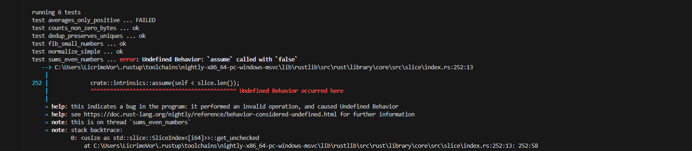

# Артефакт: Undefined Behavior в [sums_even](../src/lib.rs)

### Проблема

Вывход за пределы

### Код

```rust
pub fn sum_even(values: &[i64]) -> i64 {
    let mut acc = 0;
    unsafe {
        for idx in 0..=values.len() {
            let v = *values.get_unchecked(idx);
            if v % 2 == 0 {
                acc += v;
            }
        }
    }
    acc
}
```

### Фикс

Убираем последний элемент итерации

```rust
for idx in 0..=values.len()
```

заменяем на

```rust
for idx in 0..values.len()
```

### Логи (Miri)


