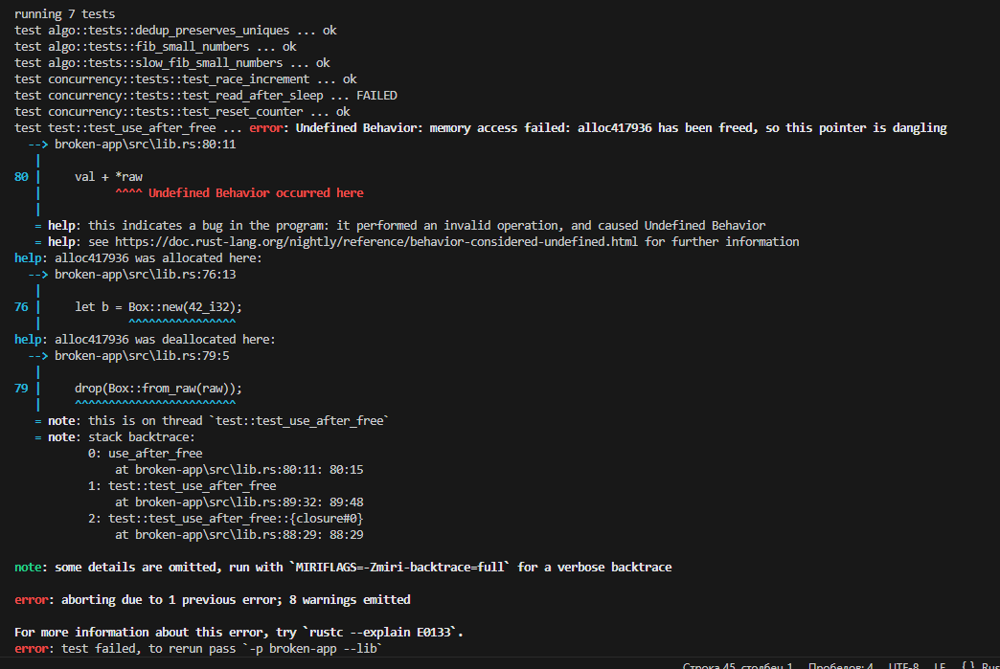

# Артефакт: Use after free в [use_after_free](../src/lib.rs)

### Проблема

Использование памяти после ее освобождения

### Код

```rust
pub unsafe fn use_after_free() -> i32 {
    let b = Box::new(42_i32);
    let raw = Box::into_raw(b);
    let val = *raw;
    drop(Box::from_raw(raw));
    val + *raw
}
```

### Фикс

Закомментируем ;)

### Логи (Miri)


