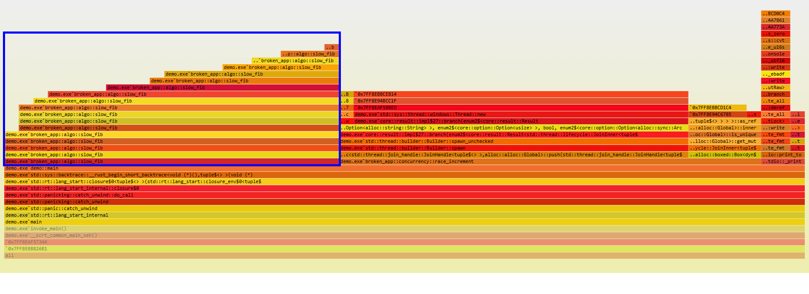
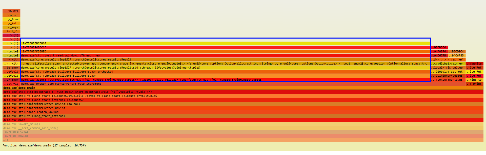
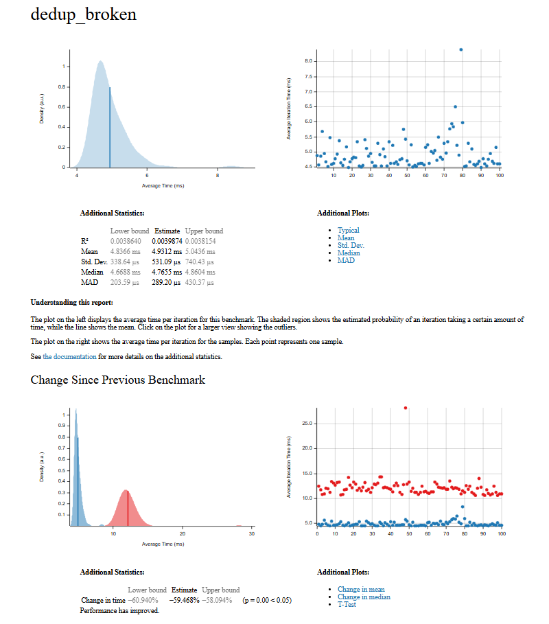
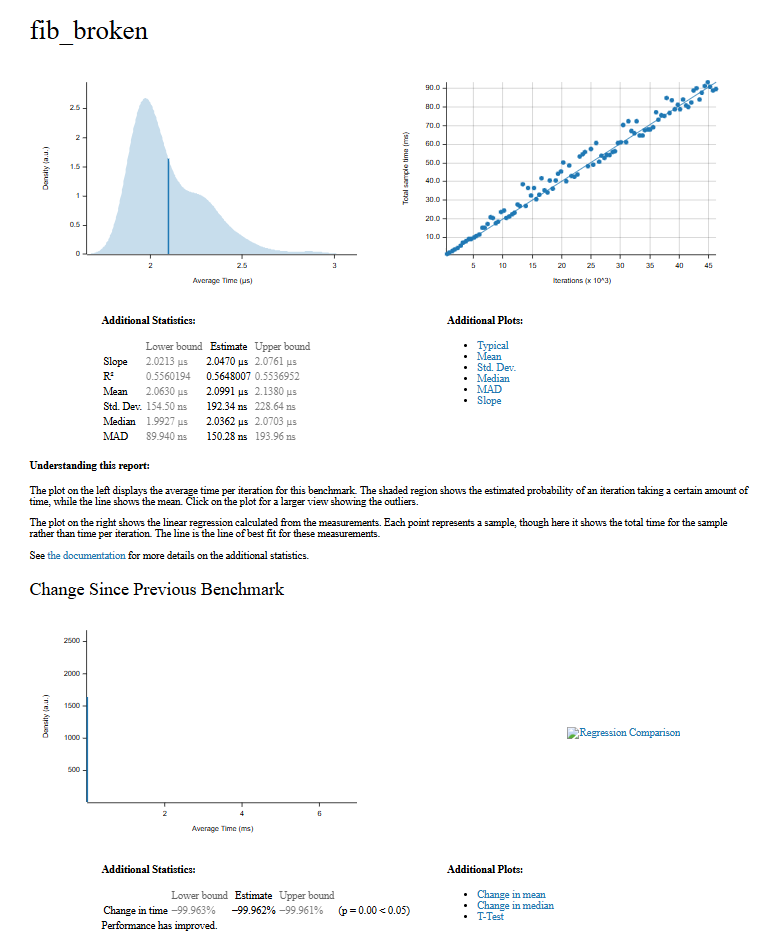

# Отчет о производительности

Профилирование demo.rs

Как видно из замера производительности framegraph ~40% всего рантайма пришлось на функцию slow_fib. Значит необходимо оптимизировать

Так же по ТЗ необходимо оптимизировать функцию slow_dedup, но здесь она не проявлена

Проведем бенчмарк функции slow_fib:

Проведен оптимизиацию функцию slow_fib -> fast_fib. Так же оптимизируем slow_dedup.

Оптимизация посчета fib позволила сократить с 5 мс до 2 нс, а оптимизиация dedup с 12 мс до 5 мс.

Проведем повторное профилирование

Как видно из замера производительности framegraph ~90% всего рантайма занимает функция race_increment

### Отчеты

