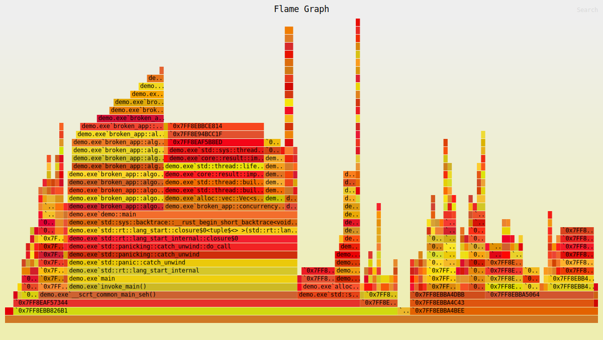
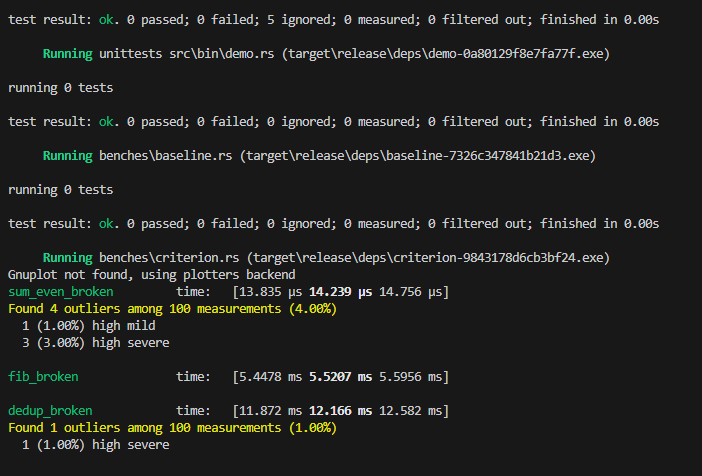
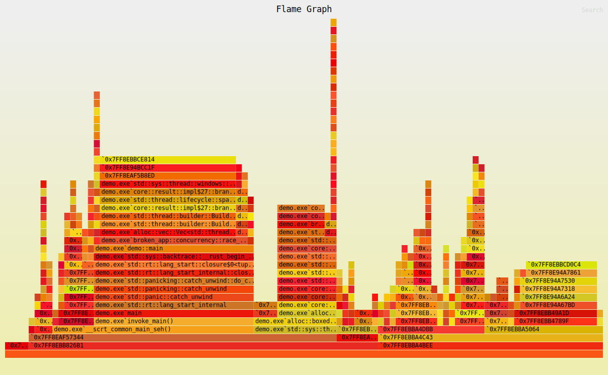
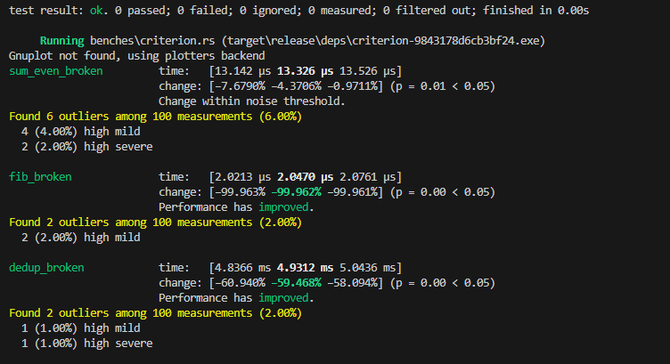

# Отладка и оптимизация Rust-приложения

## Содержание

- [Обзор проекта](#обзор-проекта)
- [Найденные и исправленные ошибки](#найденные-и-исправленные-ошибки)
- [Производительность](#производительность)
- [Структура проекта](#структура-проекта)
- [Использование](#использование)

## Обзор проекта

Проект состоит из двух основных компонентов:

- **broken-app/** - Исходное приложение с багами и проблемами производительности (исправленное)
- **reference-app/** - Пример исправленного приложения

## Найденные и исправленные ошибки

В ходе анализа были выявлены и документированы следующие критические проблемы:

### 1. Утечка буфера памяти

**Артефакт:** [leak_buffer.md](./broken-app/artifacts/leak_buffer.md)

### 2. Гонка данных при инкременте

**Артефакт:** [race_increment.md](./broken-app/artifacts/race_increment.md)

### 3. Ошибки в алгоритме суммирования четных чисел

**Артефакт:** [sums_even.md](./broken-app/artifacts/sums_even.md)

### 4. Использование после освобождения памяти

**Артефакт:** [use_after_free.md](./broken-app/artifacts/use_after_free.md)

## Производительность

### Профилирование

Для анализа производительности использовались следующие инструменты:

- **flamegraph** - для визуализации времени выполнения функций
- **criterion** - для бенчмаркинга

### Результаты оптимизации

#### До оптимизации




#### После оптимизации




### Отчеты по узким местам

- [Дедупликация данных](./broken-app/assets/report_dedup.png)
- [Вычисление чисел Фибоначчи](./broken-app/assets/report_fib.png)

## Структура проекта

```
project/
├── broken-app/           # Исходное приложение с багами
│   ├── src/             # Исходный код
│   ├── artifacts/       # Отчеты о найденных ошибках
│   ├── assets/          # Графики и диаграммы производительности
│   ├── benches/         # Бенчмарки
│   └── tests/           # Тесты
├── reference-app/       # Оптимизированная версия
│   ├── src/             # Оптимизированный код
│   ├── benches/         # Бенчмарки
│   └── scripts/         # Скрипты для анализа
└── target/              # Сборка проекта
```
